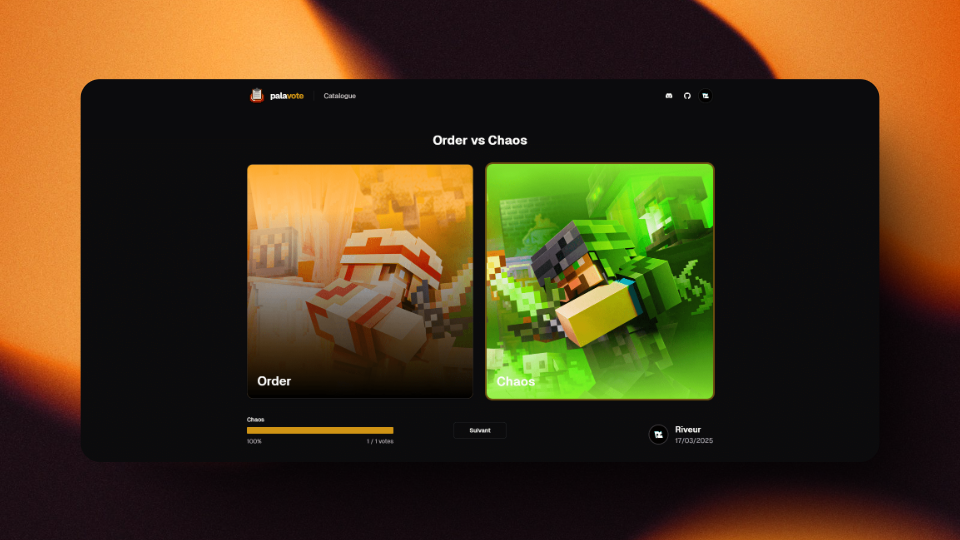

# PalaVote



## Introduction

PalaVote est une application de vote sur le thème de Paladium. Elle permet de créer des dilemmes et de voter pour les propositions. 

Les utilisateurs ont la possibilités de créer des dilemmes et de voter pour les propositions des autres utilisateurs. Lorsque vous créez un dilemme, vous devez attendre qu'un administrateur approuve la demande pour ensuite l'exposer à tous.

Une fois que vous avez voté pour une proposition, les résultats de celle-ci s'afficheront, vous aurez alors un pourcentage du nombre de personnes ayant voté comme vous.

## Roadmap

- [x] Proposer un dilemme
- [x] Voter pour une proposition
- [x] Catalogue des dilemmes
- [x] Administration des dilemmes
- [ ] Administration des utilisateurs
- [x] Authentification par Discord
- [ ] Authentification anonyme
- [ ] Liste des demandes en attente
- [ ] Bot Discord
- [ ] Historique des votes
- [ ] Et bien plus encore...

## Contribution

Le projet est open-source, si vous avez des idées pour améliorer l'application, h'hésitez pas à ouvrir une issue ou à proposer une pull request.

## Technologies

- [AdonisJS](https://adonisjs.com/) pour l'api
- [PostgreSQL](https://www.postgresql.org/) pour la base de données
- [Tanstack Router](https://tanstack.com/router/latest) pour le frontend
- [shadcn/ui](https://ui.shadcn.com/) pour le design

## Installation

### Prérequis

- Node.js (une version récente)
- pnpm
- PostgreSQL (possibilité d'utiliser le `docker-compose.yml`)

### Dépendances

Pour installer toutes les dépendances du projet, vous pouvez utiliser la commande suivante :

```bash
pnpm install
```

### Configuration: Backend

```bash
cd apps/server

cp .env.example .env # Remplissez les infos manquantes

node ace generate:key

node ace migration:fresh
```

INFO: N'oubliez pas de créer la base de données avant de lancer les migrations

### Configuration: Frontend

```bash
cd apps/web

cp .env.example .env.local # Remplissez les infos manquantes
```

### Lancer l'application

```bash
pnpm dev
```